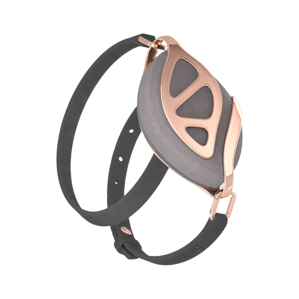

# Bellabeat Marketing strategy - Case Study

This case study focuses on providing high-level marketing recommendations for one of the renowned fitness and wellness brands, Bellabeat.

## About the company 

Bellabeat encourages women to rediscover their inner strength, tap into it, and become who they were meant to be. Giving women the tools to live in harmony with themselves is their main goal. Their selected product range includes, but not limited to, fitness tracking wristbands, pendants, yoga mats and a user-friendly app.

<table align = "center">
  <tr>
    <td>
    <td>
 </table>

## Motivation for Analysis

Bellabeat’s cofounder and Chief Creative Officer, Urška Sršen wishes to gain insight about how users interact with their smart devices. She believes that examining fitness data from smart devices could help the business find new growth prospects. By focusing on one of the company's product, this case study shall provide a clear, insightful analysis of smart device users' daily habits using a public dataset.

For the analysis we use the following dataset: 
FitBit Fitness Tracker Data : https://www.kaggle.com/arashnic/fitbit
	
## Technologies

* Python 3 - using pandas and numpy
    * Data Cleaning 
    * Data Transformation
* SQL - using BigQuery
    * Data querying
* Tableau 
    * Data visualisation

## Analysis Process

### <ins> Ask phase </ins>

#### Business Task

Using the smart device data, we get an insight on how data fetched from the consumers essentially informs about their usage and lifestyle. This is vital for developing a sense about what marketing strategies would help focus on certain aspects of the app to foster healthy practices for the overall well-being of the end user.

High-level recommendations for effective marketing strategies will be provided to the stakeholders in the form of interactive visuals and conclusions.

#### Key Stakeholders

* Urška Sršen: cofounder and Chief Creative Officer.

* Sando Mur: cofounder and a key member of the Bellabeat executive team.

* Bellabeat marketing analytics team.

### <ins> Prepare phase </ins>

#### Identifying dataset organisation

The dataset used here includes 18 CSV file. According to the dataset, 33 users' multi-level data has been recorded on a daily, hourly and minute basis on their physical activity, heartrate, sleep cycles and weight tracking. 

To query about the data structure, we use sql queries as you can never go wrong with identifying the dataset structure with SQL!

Key descriptors, assumptions and limitations:

* Each table has an ID header having values depicting individual users. Using the following sql command on each table:

```
SELECT  COUNT(DISTINCT ID)  FROM `dailyActivity_merged` 

O/P:
Row	f0_
1	33

```

* Data recorded for 31 days from 12th April, 2016 to 12th May, 2016. Using the following sql command on each table:

```
SELECT  COUNT(DISTINCT ActivityDate)  FROM `dailyActivity_merged`

O/P:

Row	f0_
1	31

```

* The data is from 2016. The pandemic has certainly affected peoples' lifestyles drastically. An updated version of the dataset would be better to provide insights.

* The dataset doesn't include the users demographics such as age and sex. Bellabeats' target audience is females and this poses as a limitation about the dataset.

#### Filtering Data

* For a high-level analysis, we shall only focus on the daily and hourly trends, not a deep-level performance tracking minute-by-minute analysis.

* After thorough comparison, turns out the datasets 'dailyCalories_merged', 'dailyIntensities_merged' and 'dailySteps_merged' are all subsets of the dataset 'dailyActivity_merged'. For the analysis, using 'dailyActivity_merged' is sufficient. More on these findings can be found in this [sql file](SQL_script.sql).

### <ins> Process Phase </ins>

#### Data transformation and cleaning

Using pandas and numpy, this process can be found here: [ipynb file]()

Key Takeaways:
* Average(Mean) Sedentry minutes is 991.2 minutes or 16.5 hours/day! That's almost close to 70% of a day.

* Most users are lightly active users.

* Average total steps per day is 7637. Recommended total steps is 10,000 according to CDC.

* Average sleep hours is 7 Hours.

## Visualisations/Share Phase

Using Tableau Public to visualise our datasets. 

[Dashboard](https://public.tableau.com/views/CaseStudyBellabeat_16792758135870/Dashboard2?:language=en-US&:display_count=n&:origin=viz_share_link)

### Total Steps vs Calories

<table align = "center">
  <tr>
    <td>
 </table>
* Quite obvious that more Active the users are, more calories they burn.

### Total time in Bed vs Total Minutes Asleep

* Total Minutes Asleep and Total Hours in Bed appear to be linearly related. So, the app should notify to go to sleep if Bellabeat users want to improve their sleep.

### Average Steps vs Hour of the day

* Most users are active from 5 pm to 7 pm. We can encourage lightly active people to be more active during that time interval.


